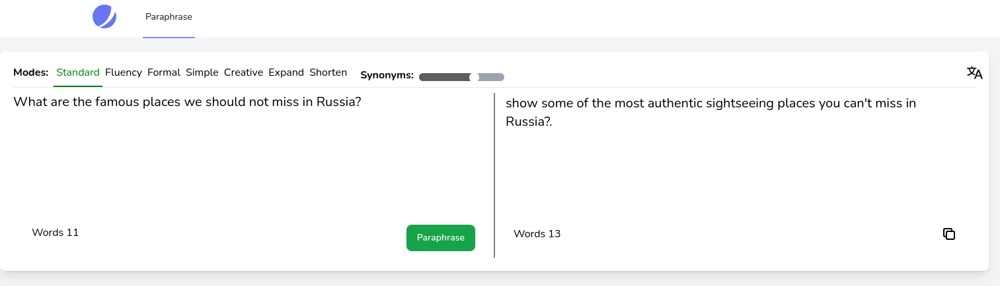

# Paraphrasing Project
This tool have multiple forms and different grammar in English for paraphrasing.

 

## All kinds of modes
- standard: This mode paraphrase the input sentences and replace new words.
- simple: This mode will translate the input sentences into a simple form.
- fluency: This mode just correct the grammar mistakes.
- formal: This mode will translate the input sentences into a formal form.
- creative: This mode change the input sentences words creatively with a little difference.
- expand: This mode will expand the input sentences and use more words in the output sentences.
- shorten: This mode will summarize the input sentences.

 

## Languages
We 3 forms of English: US-EN, UK-EN, AUS-EN

 

## Thresholds
The amount of diversity in words depends on synonyms ranges for output result. e.g. (1, 2, 3, 4)

 

## This project is closed source and i cant share the datasets and the used models but you can only use it using this domain:
http://new.keybot.tools/

 

### Examples
Standard mode

 

 

Formal mode

 

Expand mode

 

Shorten mode
